# 序

使用苹果电脑开发嵌入式项目，是一个比较小众的方案。最近调通了这个链路，踩了一些坑，随手记下，与诸君共享。

本文不是手把手教程，仅提供方案和验证思路，可能不适合刚接触stm32的新手。但在如今的这个时代，手把手的事情就交给AI吧。

# 概述

## 实现效果

用stm32CubeMX按照需求配置stm32项目工程，在VScode中编译，使用stlink下载到开发板中，这是最终的效果。

## 准备

### 硬件

1、MacOS的电脑

2、STlink下载器

3、stm32 开发版（支持SWD烧录）

### 软件

1、VScode

2、stm32CubeMX

3、stm32CubeProgramer（非必须，可以帮助验证）

### 知识

1、STlink

目前市面上能买到的，大部分都是STlinkV2，支持 SWD 和 JTAG 烧录协议。项目中使用SWD，而不使用JTAG。

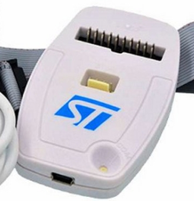

引脚定义。这里有坑，不同的厂家出厂的STlink，在大功能上都是一样的，但是不排除某些引脚的定义不一样，所以在接线的时候，以厂家的引脚定义图为准。

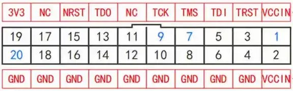

2、STM32的启动，共有三种模式

| 启动方式   | 引脚             | 用途                 |
| ---------- | ---------------- | -------------------- |
| 主Flash    | BOOT0=0          | 应用程序正常的运行   |
| 系统存储器 | BOOT0=1、BOOT1=0 | 理解是可以救砖的模式 |
| SRAM       | BOOT0=1、BOOT1=1 | 临时调试，理解用不上 |

3、STlink与STM32的连接

| STM32 | STLink   | 是否必连 | 功能                                                        |
| ----- | -------- | -------- | ----------------------------------------------------------- |
| SWIO  | TMS(7)   | 是       | SWD数据                                                     |
| SWCK  | TCK(9)   | 是       | SWD时钟                                                     |
| GND   | GND(20)  | 是       |                                                             |
| 3.3V  | VCCIN(1) | 是       | STlink检测STM32的芯片电压是否正常，如果正常则可以继续工作   |
| 3.3V  | 3V3(19)  | 否       | 如果需要使用stlink给stm32供电，则需要连。如果不需要则不用连 |

一般情况下，开发版的3.3V都不止一个。能下载程序有一个核心点，也就是STM32必须上电工作，这个电可以通过STlink提供，也可以通过其他方式提供。

# 环境搭建

## STlink 驱动

1、终端中执行

`brew install stlink`

2、检查安装结果，有输出就行（证明驱动安装成功），比如：

`st-info --probe`

> Found 0 stlink programmers

## 连接测试

1、正常情况

将STlink和STM32连接好，插上电脑，可以观察到STlink的指示灯变红，STM32开发版的电源指示灯亮。

执行指令如下指令，可观察到类似输出。并且STlink的指示灯开始红绿交替闪烁，最终变绿，则物理上的连接成功。

`st-info --probe`

> Found 1 stlink programmers
>
>  version:  V2J37S7
>
>  serial:   37FF71064E57343687561643
>
>  flash:   65536 (pagesize: 1024)
>
>  sram:    20480
>
>  chipid:   0x410
>
>  dev-type:  STM32F1xx_MD

2、异常情况

将STM32 的Boot0拉高，Boot1接地，保证STM32端是绝对可以进入swd模式的，再执行上面的指令观察结果。

## stm32CubeMX配置工程

### 关键配置（必须）

1、工具链。也就是说这个项目后续使用什么开发环境。因为要使用VScode，所以选CMake比较好用。Project Manager->Project->Project Settings。Toolchain/IDE选CMake。

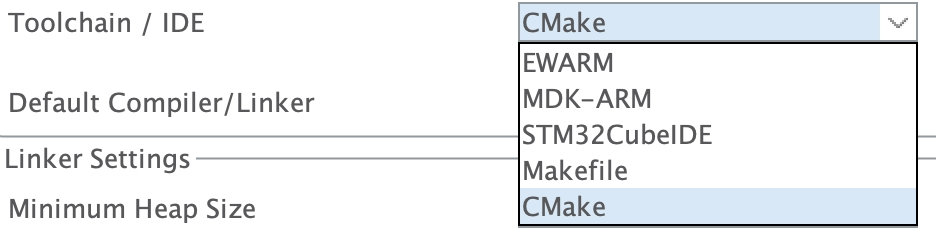

2、调试模式。要选择swd模式，否则可能会出现下载一次之后，再次下载无法进入SWD模式，从而下载失败的问题。Pinout & Configuration->Categories->System Core->SYS。Debug选择 Trace Asynchronous Sw。

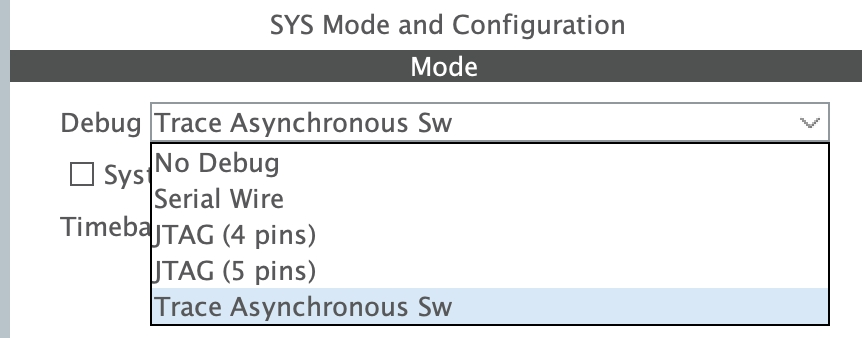

### 自定义配置（供参考）

1、芯片选型

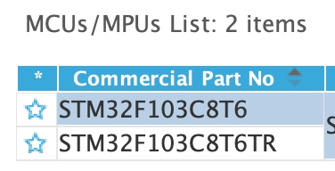

2、使用FreeRTOS。Pinout & Configuration->Categories->Middleware and Software Packs->FREERTOS。选择CMSIS_V2。

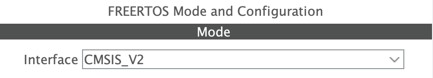

3、设置Timebase Source。因为使用了FreeRTOS，所以需要改，如果不用FreeRTOS，可以使用默认的SysTick。因为TIM4是一个通用定时器，可扩展的功能比较少。Pinout & Configuration->Categories->System Core->SYS。Timebase Source选择TIM4。

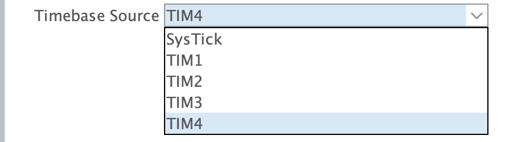

4、时钟。不使用外部晶振，使用stm32内部的hsi就够了，所以不用修改。默认满足。Pinout & Configuration->Categories->System Core->RCC。

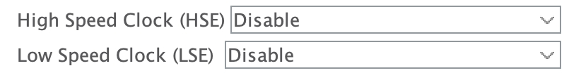

5、GPIO（PA1 Output）。点灯测试用。


## 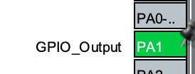代码生成

6、配置路径，项目名称，点击生成代码即可。生成完了在对应路径下可以看到如下文件。

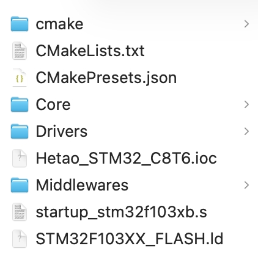

## VScode 编译、烧录

### 导入

使用VScode打开此工程，初次打开，会加载一些VScode配置，同意就行。

### 编译

点击左下角的生成，编译完成后显示生成了elf文件，则表示编译成功。


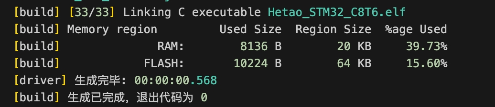

### 编码

手搓一个可以在板子上看到效果的成果。（项目是PA1 端口的LED）

### 修改任务

在.vscode文件夹下，创建task.json，添加编译烧录的功能（可以让AI完成）。仅供参考。

```
{
    "version": "2.0.0",
    "tasks": [
        {
            "label": "Build (cube-cmake)",
            "type": "shell",
            "command": "cube-cmake",
            "args": [
                "--build",
                "${workspaceFolder}/build/Release",
                "--target",
                "Hetao_STM32_C8T6"
            ],
            "group": {
                "kind": "build",
                "isDefault": true
            },
            "problemMatcher": ["$gcc"],
            "detail": "Build the STM32 project with cube-cmake and Ninja."
        },
        {
            "label": "Generate BIN",
            "type": "shell",
            "command": "arm-none-eabi-objcopy",
            "args": [
                "-O",
                "binary",
                "${workspaceFolder}/build/Release/Hetao_STM32_C8T6.elf",
                "${workspaceFolder}/build/Release/Hetao_STM32_C8T6.bin"
            ],
            "problemMatcher": [],
            "detail": "Create binary file from ELF for ST-Link flash."
        },
        {
            "label": "Flash ST-Link and Reset",
            "type": "shell",
            "command": "st-flash",
            "args": [
                "--reset",
                "write",
                "${workspaceFolder}/build/Release/Hetao_STM32_C8T6.bin",
                "0x08000000"
            ],
            "problemMatcher": [],
            "detail": "Flash the generated binary to the STM32F103 device and reset it after programming."
        },
        {
            "label": "Build and Flash",
            "dependsOn": [
                "Build (cube-cmake)",
                "Generate BIN",
                "Flash ST-Link and Reset"
            ],
            "dependsOrder": "sequence",
            "group": {
                "kind": "build",
                "isDefault": false
            },
            "detail": "Build the project, generate BIN, and flash it with ST-Link in one step."
        }
    ]
}

```

### 烧录

连接STlink。执行快捷键 cmd + shift + p，选择Tasks: Run Task -> Build and Flash。输出类似结果，则表示烧录成功。同时观察开发版的响应，是否和预期一致。

> st-flash 1.8.0
> 2026-04-19T14:32:00 INFO common.c: STM32F1xx_MD: 20 KiB SRAM, 64 KiB flash in at least 1 KiB pages.
> file /Users/chentianhai/Desktop/Hetao/01_STM32/Hetao_STM32_C8T6/build/Release/Hetao_STM32_C8T6.bin md5 checksum: c0b97ca2c9e79893f7bfb862f694e14, stlink checksum: 0x0010b536
> 2026-04-19T14:32:00 INFO common_flash.c: Attempting to write 10380 (0x288c) bytes to stm32 address: 134217728 (0x8000000)
> -> Flash page at 0x8002800 erased (size: 0x400)
> 2026-04-19T14:32:01 INFO flash_loader.c: Starting Flash write for VL/F0/F3/F1_XL
> 2026-04-19T14:32:01 INFO flash_loader.c: Successfully loaded flash loader in sram
> 2026-04-19T14:32:01 INFO flash_loader.c: Clear DFSR
>  11/11  pages written
> 2026-04-19T14:32:01 INFO common_flash.c: Starting verification of write complete
> 2026-04-19T14:32:01 INFO common_flash.c: Flash written and verified! jolly good!
> 2026-04-19T14:32:02 INFO common.c: Go to Thumb mode
>
>  *  Terminal will be reused by tasks, press any key to close it. 

# 问题

1、hex 文件无法烧录。

问题原因：st-flash 工具对hex文件的兼容性很差。

解决方案：换成bin文件就可以了。（tasks.json中已实现）

2、在MacOS的应用程序中启动Stm32CubeMX，进行操作的时候，这个应用可能会卡住。

问题原因：估计是软件对MacOS的兼容性问题。

解决方案：在终端里面打开工程文件，比如：

```
/Applications/STMicroelectronics/STM32CubeMX.app/Contents/MacOS/STM32CubeMX -s Hetao_STM32_C8T6.ioc
```

3、转接头选择

问题原因：苹果笔记本端口少，网上部分说法，stlink需要直连电脑的USB端口，否则因为什么驱动的原因无法下载程序，这是不对的。
解决方案：经过实际测试，stlink无论是接在UBS Hub上，还是直连USB，都能正常下载。

4、关键配置里面的调试模式，一定要设置为swd模式。

问题原因：大概是因为stm32启动很快，等不到比stlink的swd协议握手，就开始跑应用程序了。如果不设置的话，会出现第一次能烧录成功，后续就烧录失败，提示无法进入swd模式。后续要修复的话，就只有强制改boot的启动模式。

